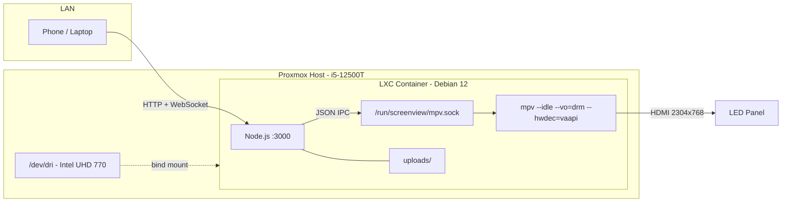

# Screenview - Media Signage App

A digital signage system running in a Proxmox LXC container, driving a 2304x768 LED panel. Media (images and videos) are uploaded and controlled via a web interface from any device on the LAN. mpv handles fullscreen display output directly over HDMI with hardware-accelerated video decode.

## Architecture




- **mpv** runs in idle mode with DRM output and VA-API hardware decode, controlled via JSON IPC over a Unix socket.
- **Node.js** serves the control web UI, handles uploads, manages playlists, and sends commands to mpv.
- **The control page** is accessed from a phone or laptop on the LAN.
- The Proxmox host's `/dev/dri` devices are bind-mounted into the container, giving mpv direct access to the Intel iGPU for both display output and hardware video decode.

## Host Setup

### Proxmox LXC Container

Create a **privileged** Debian 12 LXC container. Add GPU device passthrough to the container config (`/etc/pve/lxc/<id>.conf`):

```
lxc.cgroup2.devices.allow: c 226:* rwm
lxc.mount.entry: /dev/dri dev/dri none bind,optional,create=dir
```

This gives the container access to the Intel UHD 770 iGPU's DRM and render nodes.

### HDMI Output for 2304x768

The host's HDMI output must be configured for this non-standard resolution. Since the LXC container uses the host kernel's DRM subsystem, the resolution is set at the host level.

Option 1 -- kernel command line (in `/etc/default/grub`):

```
GRUB_CMDLINE_LINUX="video=HDMI-A-1:2304x768@60 consoleblank=0"
```

Then `update-grub` and reboot.

Option 2 -- if the LED sending card's EDID reports the correct resolution, it may work automatically.

SETUP.md will cover identifying the correct connector name (`HDMI-A-1`, `DP-1`, etc.) and troubleshooting.

### Console Blanking

Disable on the host to prevent the display going dark:

```
GRUB_CMDLINE_LINUX="... consoleblank=0"
```

## App File Structure

```
/opt/screenview/
  package.json
  config.js                # Paths, limits, dev/prod toggle
  server.js                # HTTP API + WebSocket + playback logic
  mpv-controller.js        # mpv IPC client
  state.js                 # Persistent state read/write
  state.json               # Current state on disk
  uploads/                 # Media files
  public/
    control.html
    css/control.css
    js/control.js
  setup/
    screenview.service      # systemd: Node.js
    screenview-mpv.service  # systemd: mpv
    SETUP.md
```

## mpv Controller (`mpv-controller.js`)

Manages the connection to mpv's JSON IPC socket and exposes a clean async API.

**Protocol**: mpv uses newline-delimited JSON. Each command includes a `request_id`; responses echo it back. Events (like `end-file`) arrive asynchronously without a request_id. The controller demultiplexes these: responses are matched to pending promises via a Map, events are emitted separately.

**Resilience**: Auto-reconnects on socket disconnect (exponential backoff, 1s to 10s). Commands sent while disconnected are queued and flushed on reconnect. On reconnect, re-sends the current cue to restore the display.

**API**:

```
connect()
loadFile(path, { loop, displayMode })
stop()
setProperty(name, value)
getProperty(name)
Events: 'file-ended', 'file-loaded', 'connected', 'disconnected'
```

**Display modes** (mpv properties set after loading a file):

- **stretch**: `keepaspect=no` -- fills panel, content distorted horizontally for non-3:1 content
- **centered**: `keepaspect=yes, panscan=0` -- letterboxed, preserves aspect ratio
- **fill**: `keepaspect=yes, panscan=1.0` -- fills panel, crops to fit

## Data Model (`state.json`)

```json
{
  "library": [
    { "id": "abc123", "filename": "abc123-beach.mp4", "originalName": "beach.mp4", "type": "video", "size": 12345678, "addedAt": "..." }
  ],
  "playlist": [
    { "id": "cue1", "mediaId": "abc123", "settings": { "loop": true, "displayMode": "fill", "duration": null } }
  ],
  "currentCueIndex": -1
}
```

- **library**: All uploaded files. UUID-prefixed filenames on disk to avoid collisions.
- **playlist**: Ordered cue list. Each cue references a library item and carries its own settings:
  - **loop**: Video loops until manually advanced. Ignored for images.
  - **displayMode**: "stretch", "centered", or "fill".
  - **duration**: Seconds before auto-advance. `null` = stay until manual GO.
- **currentCueIndex**: Active cue. `-1` = stopped (black screen).

State is saved via atomic writes (write tmp file, rename) with a 100ms debounce for rapid changes.

## REST API


| Method | Endpoint                | Description                                                                  |
| ------ | ----------------------- | ---------------------------------------------------------------------------- |
| POST   | `/api/upload`           | Upload media. Validates format, size (1GB max), disk space (500MB min free). |
| GET    | `/api/library`          | List all uploaded media.                                                     |
| DELETE | `/api/library/:id`      | Delete media, disk file, and any referencing playlist cues.                  |
| GET    | `/api/playlist`         | Get playlist.                                                                |
| POST   | `/api/playlist`         | Add cue (mediaId + settings).                                                |
| PUT    | `/api/playlist/:cueId`  | Update cue settings. Live-updates display if editing active cue.             |
| DELETE | `/api/playlist/:cueId`  | Remove cue.                                                                  |
| PUT    | `/api/playlist/reorder` | Reorder cues (array of IDs).                                                 |
| POST   | `/api/go`               | Advance to next cue. Black screen if at end.                                 |
| POST   | `/api/go/:cueId`        | Jump to specific cue.                                                        |
| POST   | `/api/stop`             | Stop playback (black screen).                                                |
| GET    | `/api/state`            | Full state + disk free space.                                                |


Accepted formats: jpg, jpeg, png, gif, webp, bmp, mp4, webm, mkv, avi, mov, m4v.

## Playback Logic

### Rules


| Content | Loop | Duration  | Behavior                                             |
| ------- | ---- | --------- | ---------------------------------------------------- |
| Video   | ON   | (ignored) | Loops until manual GO                                |
| Video   | OFF  | null      | Plays once, auto-advances on end                     |
| Video   | OFF  | N sec     | Auto-advances on video end or timer, whichever first |
| Image   | --   | null      | Stays until manual GO                                |
| Image   | --   | N sec     | Auto-advances after N seconds                        |


When the last cue finishes, playback stops (black screen). The playlist does not loop.

### Transition Safety

An `isTransitioning` lock prevents double-advance from race conditions. Set when an advance begins, cleared when mpv confirms the new file is loaded or after a 2-second safety timeout.

### Orchestration Flow

1. `playCue(index)` -- checks lock, cancels running timer, loads file in mpv with cue settings, starts duration timer if applicable.
2. `advance()` -- increments index, calls `playCue`. Past the end = black screen.
3. mpv `file-ended` (eof) -- calls `advance()` for non-looping videos.
4. Duration timer expiry -- calls `advance()`.

Both #3 and #4 check the lock. First to fire wins; the other is a no-op.

## Control Page UI

A dark, professional web interface inspired by theatre cue systems. Accessed at `http://<host-ip>:3000/control`.

### Layout

**Left: Media Library**

- Drag-and-drop upload area with per-file progress bars
- Thumbnail grid (scaled images; generic icon for videos)
- Name, type badge, file size, delete button per item
- "+" button to add to playlist
- Disk space indicator at bottom

**Right: Playlist / Cue List**

- Numbered rows (Q1, Q2, Q3...) with media name and settings icons
- Drag handles to reorder
- Click to select (reveals settings in bottom bar)
- Active cue highlighted in green
- Large **GO** button (disabled during transitions) and **STOP** button
- Double-click a cue to jump to it
- Status line showing current playback state

**Bottom: Cue Settings** (for selected cue)

- Loop toggle (video only)
- Display mode: Stretch / Centered / Fill
- Duration input with "Hold" toggle for indefinite
- Changes apply immediately; active cue updates the display live

### Real-time Sync

WebSocket connection to the server. State changes are broadcast to all connected control pages.

### Style

- Dark background (#1a1a2e), high contrast text
- Monospaced cue numbers, clean sans-serif labels
- Green accent on active cue
- Responsive: panels stack vertically on phone

## systemd Services

Both run inside the LXC container with `Restart=always`.

**screenview.service** (Node.js):

```ini
[Unit]
Description=Screenview Media Server
After=network.target

[Service]
Type=simple
User=screenview
WorkingDirectory=/opt/screenview
ExecStart=/usr/bin/node server.js
Restart=always
RestartSec=3
Environment=NODE_ENV=production
Environment=MPV_SOCKET=/run/screenview/mpv.sock

[Install]
WantedBy=multi-user.target
```

**screenview-mpv.service** (mpv):

```ini
[Unit]
Description=Screenview mpv Display
After=screenview.service

[Service]
Type=simple
User=screenview
RuntimeDirectory=screenview
ExecStart=/usr/bin/mpv --idle --force-window=yes \
    --input-ipc-server=/run/screenview/mpv.sock \
    --vo=drm --hwdec=vaapi --fs --no-terminal --really-quiet \
    --no-input-default-bindings --no-osc --no-osd-bar \
    --image-display-duration=inf
Restart=always
RestartSec=3
SupplementaryGroups=video render

[Install]
WantedBy=multi-user.target
```

## Dev Mode

For local development on macOS/Linux:

```bash
# Terminal 1: mpv windowed
mpv --idle --force-window=yes --input-ipc-server=/tmp/screenview-mpv.sock \
    --geometry=1280x720 --no-osc --no-osd-bar --no-input-default-bindings

# Terminal 2: server
MPV_SOCKET=/tmp/screenview-mpv.sock NODE_ENV=development node server.js
```

## Config (`config.js`)

```javascript
module.exports = {
  port: process.env.PORT || 3000,
  mpvSocket: process.env.MPV_SOCKET || '/run/screenview/mpv.sock',
  uploadsDir: process.env.UPLOADS_DIR || './uploads',
  maxFileSize: process.env.MAX_FILE_SIZE || 1024 * 1024 * 1024,
  minFreeDisk: process.env.MIN_FREE_DISK || 500 * 1024 * 1024,
  isDev: process.env.NODE_ENV !== 'production',
};
```

## Edge Cases

- **mpv crash**: systemd restarts it; controller reconnects and re-sends current cue.
- **Server crash**: systemd restarts it; reads state.json and resumes.
- **Delete playing media**: Advances to next cue or stops.
- **Corrupt state.json**: Starts empty, renames corrupt file for debugging.
- **Disk full**: Upload rejected if <500MB would remain.
- **Display disconnected at boot**: mpv retries via systemd restart until display available.
- **Multiple control sessions**: All stay in sync via WebSocket.
- **Edit active cue settings**: Display updates immediately.
- **Double-advance race**: Transition lock prevents it.

## Implementation Steps

1. Scaffold: `package.json`, `config.js`, install deps
2. `mpv-controller.js`: IPC client with request tracking, event demux, reconnect, queue
3. `state.js`: atomic load/save, corruption recovery, debounced writes
4. `server.js`: REST API, playback orchestration, WebSocket broadcast
5. Control page: HTML/CSS/JS with library, playlist, settings, upload progress
6. systemd service files
7. SETUP.md: LXC creation, /dev/dri passthrough, HDMI resolution, packages, deploy

